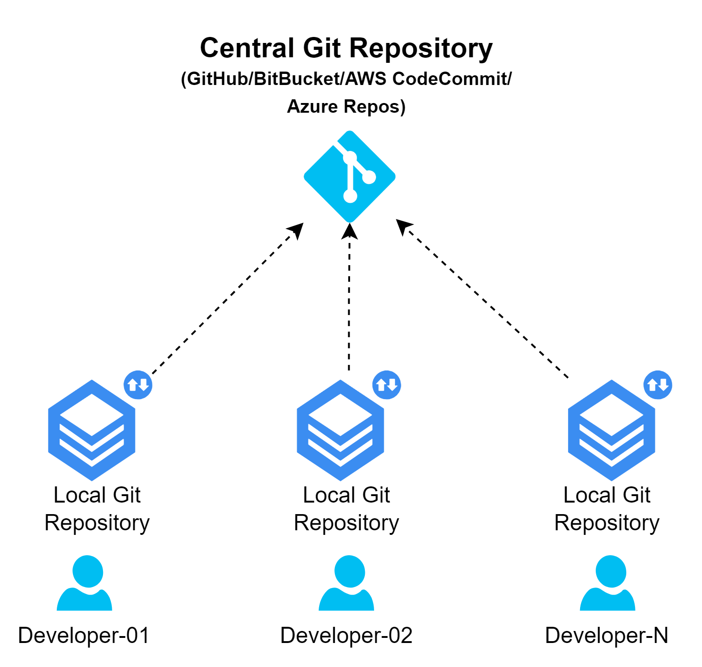

# Introduction to GitHub

## 01. What is GitHub?

- GitHub is a developer platform that allows developers to create, store, manage and share their code.
- It uses _Git_ software, providing the distributed version control of Git
- Git also provides many other important dev features for every project, like:
  1. Access control
  2. Bug tracking
  3. Software feature requests
  4. Task management
  5. Continuous integration
  6. Documentation

## 02. Why use GitHub?

- Version Control
- Collaboration
- Project Management
- Community Engagement
- Continuous Integration & Delivery
- Documentation & Wiki
- Bug Tracking
- Security and Compliance
